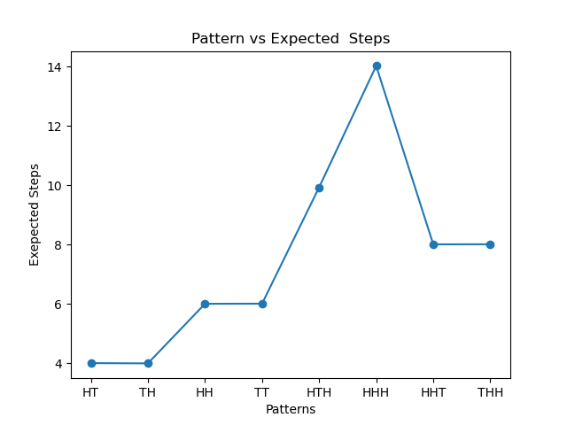
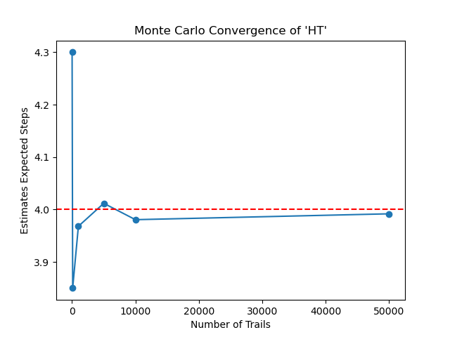
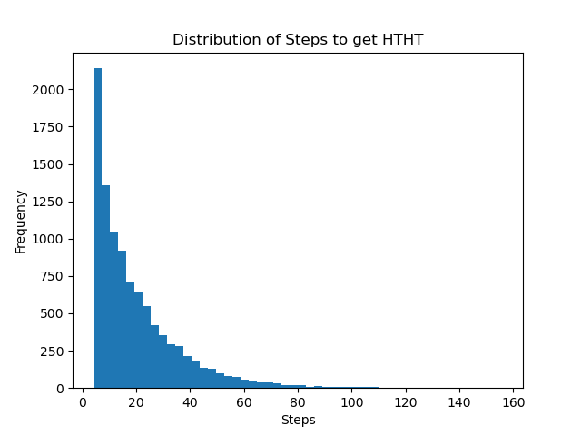

Why does "HT" appear faster than "HH" in coin tosses?

HT → 4 steps  
HH → 6 steps  

Even though both have same probability.

## What’s happening

At first, HT and HH seem equally likely.

But the difference comes from how patterns behave over time.

- HT does not overlap with itself  
- HH overlaps with itself  

For example, in a sequence like HHH:
- You are already partially matching HH again

This means the process doesn’t fully reset each time, which increases the waiting time.

So even though probabilities are the same, the expected waiting time is different.

## What I did

- Thought about the problem in terms of states (no match, partial match, full match)  
- Used this idea to estimate the expected number of steps  
- Wrote a simulation that repeatedly generates coin tosses and measures how long it takes for a pattern to appear  
- Averaged over many trials to approximate the expected value  

This is essentially computing the **hitting time** — the time it takes for a random process to reach a condition for the first time.

## Visualizations

### Pattern vs Expected Steps
Shows how different patterns take different amounts of time depending on their structure.

---

### Monte Carlo Convergence
Shows how simulation results stabilize as the number of trials increases.

---

### Distribution of Steps
Shows how much variation there is in the number of steps needed for a pattern to appear.

This shift in thinking — from probability to time — is what makes the problem interesting.

### Finance

This is not just about coin tosses.

This is about how long it takes for a random process to reach a condition.

If we think of price movement as random (up/down):

- H → price goes up  
- T → price goes down  

Then this problem becomes:

How long does it take for price to reach a level?

This is the same idea as:
- Stop-loss hitting time  
- Barrier options  
- Random walk models  

The same mathematics appears in quantitative finance.

This made me curious about:

- Continuous-time models  
- Brownian motion  
- Real price data  

I want to see how this idea extends beyond simple models into more realistic systems.
